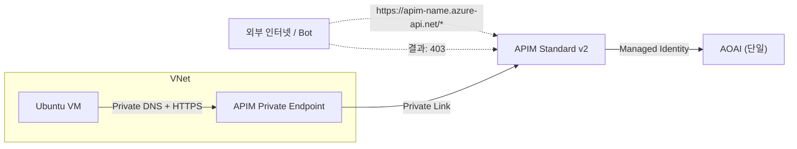

# APIM Standard v2 Private Endpoint 최소 검증 가이드

## 목적

다음 핵심 항목만 검증합니다.

- VNet 내부 VM에서 APIM 호출이 정상 동작하는지 (`200`)
- APIM이 Azure OpenAI로 프록시 호출을 정상 수행하는지
- 외부(퍼블릭) 요청이 APIM 라우팅 전에 차단되는지 (`403`)

이 검증은 Bot의 임의 URL 호출로 APIM 요청 한도가 소모되는 문제를 줄이는 데 초점을 둡니다.

## 현재 검증 구성

- APIM: `StandardV2`
- Public Network Access: `Disabled`
- Private Endpoint: `Gateway`
- 백엔드 AOAI: 단일 1개 (`<aoai-resource-name>`)
- 모델 배포: `gpt-5.2`
- 테스트 API:
  - `POST /chat/test1`
  - `POST /chat/test2`

## 아키텍처



## 포함된 파일

- `infra/modules/network.bicep`: VNet, VM/PE 서브넷, NSG
- `infra/modules/vm.bicep`: 테스트 VM (Public IP는 SSH 제한 용도)
- `infra/modules/apim.bicep`: APIM, API, Operation, Policy
- `infra/modules/private-endpoint.bicep`: Private Endpoint, Private DNS Zone
- `infra/main.bicep`: 전체 오케스트레이션
- `scripts/deploy.sh`: 배포 스크립트
- `scripts/cleanup.sh`: 삭제 스크립트
- `validation-results.ko.md`: 실제 실행 결과 및 해석 보고서

## 사전 준비

- `az login` 완료
- APIM/네트워크/역할할당 권한
- AOAI 리소스 및 배포(`gpt-5.2`) 존재

## 파라미터 설정

`infra/main.parameters.json`에서 최소 아래 값을 확인합니다.

- `location`
- `apimName`
- `apimPublisherEmail`
- `apimPublisherName`
- `vmAdminPassword`
- `allowedSshSourceIp`
- `backend1Url`
- `backend2Url`

단일 AOAI 테스트 시 `backend1Url`과 `backend2Url`을 동일 값으로 설정합니다.

## 배포

```bash
cd scripts
DO_WHAT_IF=true ./deploy.sh
DO_WHAT_IF=false ./deploy.sh
```

## 권한 부여 (APIM MI -> AOAI)

```bash
APIM_PRINCIPAL_ID="<output-apimPrincipalId>"
AOAI_ID="/subscriptions/<sub>/resourceGroups/<rg>/providers/Microsoft.CognitiveServices/accounts/<aoai-name>"
ROLE_ID="5e0bd9bd-7b93-4f28-af87-19fc36ad61bd"

az role assignment create --assignee-object-id "$APIM_PRINCIPAL_ID" --assignee-principal-type ServicePrincipal --role "$ROLE_ID" --scope "$AOAI_ID"
```

두 백엔드 URL이 동일 AOAI라면 1회 부여로 충분합니다.

## 검증

### 내부 검증 (VM)

```bash
nslookup <apim-name>.azure-api.net

curl -i "https://<apim-name>.azure-api.net/chat/test1" \
  -H "Content-Type: application/json" \
  -d '{"messages":[{"role":"user","content":"hello"}]}'

curl -i "https://<apim-name>.azure-api.net/chat/test2" \
  -H "Content-Type: application/json" \
  -d '{"messages":[{"role":"user","content":"hello"}]}'
```

기대값: `200 OK`

### 외부 검증

```bash
curl -i "https://<apim-name>.azure-api.net/chat/test1"
curl -i "https://<apim-name>.azure-api.net/.env"
curl -i "https://<apim-name>.azure-api.net/admin"
```

기대값: 모두 `403 Access Denied`

## 검증 완료 요약

실제 검증 결과(상세: `validation-results.ko.md`):

- 내부(VNet/VM) 호출: `/chat/test1`, `/chat/test2` 모두 `200 OK`
- 외부(퍼블릭) 호출: API 경로 및 임의 URL 모두 `403 Access Denied`
- 메트릭 관측: 외부 `403` 다건 호출은 APIM `Requests` 증가를 유발하지 않았고, 내부 호출은 증가 포인트가 확인됨

운영 해석:

- 외부 Bot 트래픽이 APIM API 처리 경로를 타지 않도록 차단되어, 요청 한도 소모 리스크를 낮추는 방향으로 동작함

## 정리

```bash
cd scripts
./cleanup.sh
```
