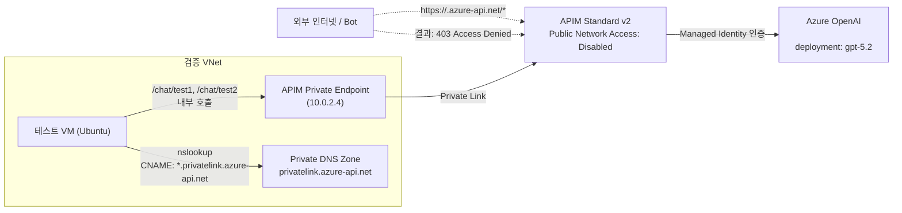

# APIM Private Endpoint 검증 결과 보고서

## 1. 검증 목적

본 검증의 핵심 목적은 다음 2가지를 확인하는 것이었습니다.

- 내부망(VNet)에서의 APIM 호출은 정상 동작해야 함
- 외부(퍼블릭)에서의 요청은 APIM 라우팅 전에 원천 차단되어야 함

배경 이슈는 Bot이 임의 URL(`/.env`, `/admin` 등)을 대량 호출해 404를 유발하고, APIM 요청 한도를 소모하는 문제였습니다.

## 2. 실제 검증 환경

- APIM SKU: `StandardV2`
- APIM Public Network Access: `Disabled`
- APIM 접근 경로: Private Endpoint (`Gateway`) + Private DNS (`privatelink.azure-api.net`)
- 테스트 VM: VNet 내부 Ubuntu VM
- AOAI 연동: 단일 AOAI 리소스 1개 (`<aoai-resource-name>`)에 두 경로 모두 연결
- 모델 배포: `gpt-5.2`

## 2.1 아키텍처 도식 (Mermaid)




## 3. 검증 시나리오와 결과

### 3.1 내부 DNS 확인 (VM 내부)

실행: `nslookup <apim-name>.azure-api.net`

결과 요약:
- `<apim-name>.azure-api.net`
- CNAME: `<apim-name>.privatelink.azure-api.net`
- A 레코드: `10.0.2.4`

판정: 성공

해석:
- APIM 호스트명이 퍼블릭 IP가 아니라 Private Endpoint IP로 해석됨
- 내부 트래픽이 Private Link 경로를 사용하고 있음을 확인

### 3.2 내부 API 호출 (VM 내부)

실행:
- `POST /chat/test1`
- `POST /chat/test2`

결과 요약:
- `/chat/test1`: `HTTP/1.1 200 OK`
- `/chat/test2`: `HTTP/1.1 200 OK`
- 응답 본문 `model`: `gpt-5.2-2025-12-11`

판정: 성공

해석:
- APIM -> AOAI 프록시 경로가 정상 동작
- APIM 정책(backend 설정 + managed identity 인증 + URI rewrite)이 유효하게 작동

### 3.3 외부(퍼블릭) 차단 확인

실행:
- `curl -i https://<apim-name>.azure-api.net/chat/test1`
- `curl -i https://<apim-name>.azure-api.net/.env`
- `curl -i https://<apim-name>.azure-api.net/admin`

결과 요약:
- 모든 요청 `HTTP/1.1 403 Access Denied`
- 메시지에 `public network access ... is disabled` 포함

판정: 성공

해석:
- 외부 요청은 APIM API 라우팅까지 도달하지 못하고 앞단에서 차단
- Bot의 랜덤 URL 스캔 요청이 APIM API 처리 경로를 타지 않음

### 3.4 메트릭 기반 추가 검증 (Request Limit 영향)

질문 포인트:
- 외부 `403` 차단 요청이 실제 APIM 요청 카운트/한도에 반영되는가?

검증 방법:
- APIM 메트릭 `Requests`를 1분 집계(`PT1M`, `Total`)로 조회
- 외부에서 `/chat/test1`를 연속 10회 호출(모두 `403` 확인)
- 이후 동일 메트릭 시계열의 non-zero 포인트 변화를 확인
- 비교를 위해 VM 내부에서 APIM 호출 1회 실행 후 동일 메트릭 재조회

실제 관측:
- 외부 `403` 10회 호출 직후: `Requests`의 유의미한 증가 없음
- 내부 호출 실행 후: `Requests`에 신규 증가 포인트 확인 (`1.0`)

해석:
- 외부 차단(`publicNetworkAccess=Disabled`) 요청은 APIM 게이트웨이 처리 요청으로 카운트되지 않거나, 최소한 Request 메트릭 기준으로는 증가를 유발하지 않음
- 반면 내부 경로를 통한 실제 APIM 처리 요청은 `Requests` 메트릭에 반영됨
- 따라서 본 검증 범위 내에서는 "외부 Bot 트래픽으로 Request Limit이 소진되는 문제"가 재현되지 않음

## 4. 종합 결론

검증 목표는 모두 충족되었습니다.

- 내부 요청: 정상 처리 (`200`)
- 외부 요청: 원천 차단 (`403`)
- 메트릭 검증: 외부 `403` 다건 호출은 `Requests` 증가를 유발하지 않음 (내부 호출은 증가)

따라서 본 구성은 "외부 Bot 트래픽으로 인해 APIM 요청 처리 경로가 소모되는 문제"를 완화하는 데 유효합니다.

## 5. 운영 관점 해석

- `404` 기반 방어(요청이 APIM 라우팅까지 들어온 뒤 미일치)보다
- `403` 기반 차단(퍼블릭 네트워크 자체 차단)이 더 근본적인 제어 방식
- 실측 기준으로도 외부 `403` 차단 트래픽은 APIM `Requests` 메트릭 증가로 이어지지 않았음

즉, 이번 결과는 "노출 최소화 + 불필요 트래픽 차단"이라는 원래 목적에 부합합니다.

## 6. 현재 테스트 범위의 제한

- 이번 최종 검증은 안정성을 위해 AOAI 1개로 단순화해 수행
- 원래 계획의 "리전별 서로 다른 AOAI 2개" 시나리오는 포털/환경 안정 시 추가 확장 가능
- 메트릭 반영은 Azure Monitor 지연(수 분) 영향을 받으므로, 장시간/고빈도 트래픽에서는 별도 장기 관찰 권장

## 7. 재현용 핵심 명령

### 내부(VM) 검증

```bash
nslookup <apim-name>.azure-api.net

curl -i "https://<apim-name>.azure-api.net/chat/test1" \
  -H "Content-Type: application/json" \
  -d '{"messages":[{"role":"user","content":"hello"}]}'

curl -i "https://<apim-name>.azure-api.net/chat/test2" \
  -H "Content-Type: application/json" \
  -d '{"messages":[{"role":"user","content":"hello"}]}'
```

### 외부 검증

```bash
curl -i "https://<apim-name>.azure-api.net/chat/test1"
curl -i "https://<apim-name>.azure-api.net/.env"
curl -i "https://<apim-name>.azure-api.net/admin"
```
